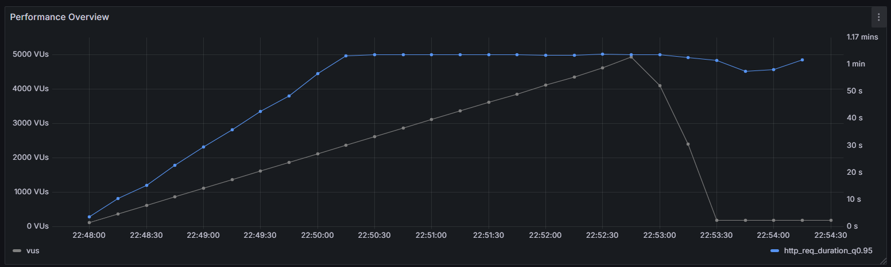

# 이커머스 주문 부하 테스트 결과 분석 및 장애 대응 보고서
## 1. 테스트 개요
- **대상 API**: 이커머스 주문 생성 API (/orders, HTTP POST)
- **목적**: 5000명의 동시 사용자가 주문을 생성하는 상황에서 시스템의 성능을 평가하고, 병목을 탐색 및 개선
- **테스트 조건**:
  - 5000명의 가상 사용자(VU)가 5분 동안 지속적으로 주문 요청
  - 사용자 ID, 주문 상품 ID는 고정
  - DB 연결(HikariCP), 트랜잭션 처리, 응답 시간 모니터링
- **테스트 도구**: k6, Grafana, Prometheus

## 2. 성능 지표 분석
### 주요 성능 지표


 ```
 checks.........................: 10.97% 2152 out of 19604
 data_received..................: 1.1 MB 3.4 kB/s
 data_sent......................: 3.2 MB 9.7 kB/s
 http_req_blocked...............: avg=859.63ms min=0s         med=5.7ms    max=20.14s  p(90)=1.28s    p(95)=8.42s   
 http_req_connecting............: avg=798.13ms min=-5940034ns med=5.34ms   max=19.92s  p(90)=1.2s     p(95)=8.26s   
 http_req_duration..............: avg=33.67s   min=0s         med=50.24s   max=1m12s   p(90)=1m0s     p(95)=1m0s    
   { expected_response:true }...: avg=31.97s   min=160.99ms   med=34.52s   max=59.97s  p(90)=53.97s   p(95)=56.15s  
 http_req_failed................: 89.02% 17452 out of 19604
 http_req_receiving.............: avg=285.07µs min=0s         med=0s       max=144.5ms p(90)=370.76µs p(95)=1.56ms  
 http_req_sending...............: avg=43.16ms  min=0s         med=114.21µs max=6.42s   p(90)=7.63ms   p(95)=101.93ms
 http_req_tls_handshaking.......: avg=0s       min=0s         med=0s       max=0s      p(90)=0s       p(95)=0s      
 http_req_waiting...............: avg=33.63s   min=0s         med=50.04s   max=1m12s   p(90)=1m0s     p(95)=1m0s    
 http_reqs......................: 19604  59.052452/s
 iteration_duration.............: avg=39.91s   min=1.05s      med=1m1s     max=1m30s   p(90)=1m6s     p(95)=1m11s   
 iterations.....................: 19601  59.043415/s
 vus............................: 191    min=0              max=4983
 vus_max........................: 5000   min=2565           max=5000
 ```

|성능 지표|결과|
|:--|:--|
|총 요청 수|19,604|
|성공률 (200 OK 응답 비율)|10.97% (2,152 / 19,604)|
|실패율 (Timeout 포함)|89.02% (17,452 / 19,604)|
|평균 응답 시간|33.67초|
|p90 응답 시간|60초 (90%의 요청이 60초 이내 응답)|
|p95 응답 시간|60초|
|최대 응답 시간|1분 12초|
|평균 요청 대기 시간|33.63초|

### 주요 문제점 요약
- 응답 속도가 너무 느리다. (평균 33.67초, 최대 1분 12초)
- 실패한 모든 요청이 Timeout 발생한다. (89.02% 실패율)
- DB 연결 대기 시간과`http_req_connecting` 평균 798ms), 요청 차단 시간(`http_req_blocked` 평균 859ms)이 길다.

## 3. 병목 탐색 및 원인 분석
### 1. DB 커넥션 부족 (HikariCP Connection Pool)
- HikariCP 기본 설정(`maximum-pool-size: 10`)으로 인해 DB 커넥션이 부족하여 요청이 큐에서 대기한다.
- k6 로그에서 평균 `http_req_waiting` 33.63초 → 커넥션 풀 부족으로 인해 다수의 요청이 타임아웃 발생한다.
- `max=5000 VU`의 요청을 감당하기에는 커넥션 풀 크기가 너무 작다.

### 2. 트랜잭션 병목 (OrderService 내 동기 처리)
- 주문 생성 시 재고 감소, 쿠폰 사용이 포함되어 있다.
- 동기 트랜잭션으로 실행되며, 모든 요청이 직렬화되어 처리 속도가 느려진다.
- 1건의 주문이 평균 33초 걸리므로, 동시 요청이 많을수록 전체 응답 시간이 증가한다.

### 3. 비효율적인 쿼리 실행 (DB Lock, 인덱스 문제 가능성)
- 재고 감소에서 UPDATE 쿼리가 트랜잭션 내에서 실행되면서 DB Lock이 발생할 가능성이 있다.
- 쿠폰 사용 처리도 동시 요청이 몰리면 Deadlock 가능성 존재한다.
- 주문 데이터 삽입 시 INSERT 성능 저하 가능성이 있다.

## 4. 개선 방안
### 1. DB 커넥션 풀 확장
| 설정 항목|	기존 값|	변경 값|
|:--|:--|:--|
|maximum-pool-size|	10|	50~100|
|minimum-idle|	10|	30|
|connection-timeout|	10s|	30s|

- **개선 효과** :
  - 커넥션 부족으로 인한 요청 대기 시간(`http_req_waiting`) 감소
  - 동시에 더 많은 요청을 처리할 수 있도록 개선

### 2. 트랜잭션 비동기 처리 및 Kafka 도입
- 주문 생성 API 내부에서 동기 실행되는 프로세스를 분리
- 재고 감소, 쿠폰 사용을 Kafka 이벤트 기반 비동기 처리


- **개선 효과:**
  - 주문 요청을 빠르게 저장하고 후속 처리는 비동기로 실행하여 응답 시간 개선
  - 트랜잭션 경합을 줄여 동시 처리량 증가

### 3. DB 튜닝
- 재고 감소에서 UPDATE 실행 시 WHERE product_id AND stock > 0 조건 추가
- 쿠폰 사용에 대해 coupon_id, user_id 복합 인덱스 추가

## 5. 장애 대응 계획
### 1. 장애 시나리오 분석
|장애 유형|원인|대응 방안|
|:--|:--|:--|
|대량 Timeout 발생|	DB 커넥션 부족	|HikariCP 풀 크기 증가, Redis 캐싱|
|트랜잭션 경합|	동시 주문으로 인한 DB 락	|Kafka 비동기 처리 도입|
|DB Deadlock|	쿠폰/재고 감소 시 다중 트랜잭션 충돌|	`FOR UPDATE SKIP LOCKED` 활용|

### 2. 장애 발생 시 대응 절차
- **부하 테스트 중 서비스 응답 시간이 10초 이상 지속될 경우**
  - DB 커넥션 사용량 확인 (SHOW PROCESSLIST;)
  - Deadlock 여부 점검 (SHOW ENGINE INNODB STATUS;)
  - 필요한 경우 DB 트랜잭션 강제 해제 (KILL <thread_id> 실행)
- **5000명 동시 요청 시 API 응답률 90% 이상 실패할 경우**
  - Kafka 이벤트 기반 비동기 처리 적용 후 재테스트
  - DB Query Slow Log 분석 후 인덱스 추가, 쿼리 최적화 적용

## 6. 결론
이번 부하 테스트를 통해 **DB 커넥션 부족, 트랜잭션 경합, 비효율적인 쿼리 실행**이 성능 저하의 주요 원인임을 확인했다.
**HikariCP 커넥션 풀 조정, Kafka 이벤트 기반 비동기 처리, DB 튜닝을 적용하여 성능을 개선**할 예정이다.<br>
또한 장애 대응 계획을 수립하여 실시간 모니터링 및 장애 발생 시 빠른 대응이 가능하도록 준비할 것이다.
