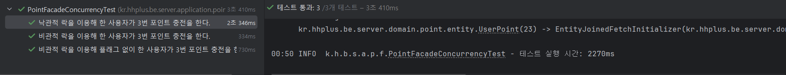
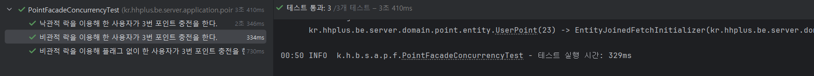
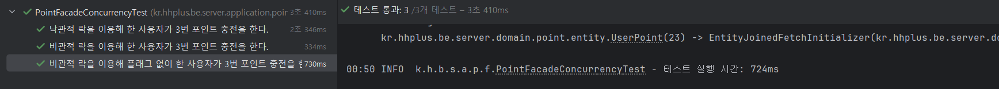
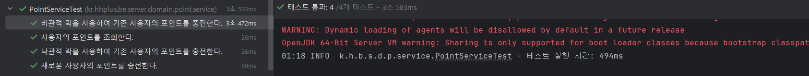
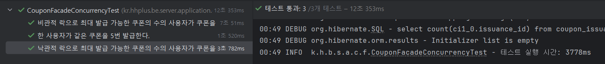

# 시나리오별 동시성 제어 분석 보고서
## 동시성 제어 방식

### 1. 낙관적 락 (Optimistic Locking)
낙관적 락은 데이터에 대한 접근이 충돌하지 않을 것이라고 가정하고, 데이터 수정 시점에만 충돌을 검사하는 방식입니다. 이 방식은 주로 읽기 작업이 많은 환경에서 유용한다.

#### 작동 방식
1. 데이터를 읽어온 후, 수정할 데이터를 메모리에 저장한다.
2. 데이터 수정이 완료되면, 데이터베이스에 업데이트를 시도한다.
3. 이때, 데이터가 수정되었는지 확인하기 위해 버전 번호나 타임스탬프를 사용한다.
4. 만약 데이터가 수정되었다면, 업데이트를 실패하고, 다시 시도하거나 에러를 반환한다.

#### 장점
- 충돌이 적은 경우 성능이 좋다.
- 락을 사용하지 않기 때문에 대기 시간이 줄어든다.

#### 단점
- 충돌이 발생할 경우 재시도가 필요하므로, 성능 저하가 발생할 수 있다.

### 2. 비관적 락 (Pessimistic Locking)
비관적 락은 데이터에 대한 접근이 충돌할 것이라고 가정하고, 데이터에 접근할 때마다 락을 걸어 다른 프로세스가 접근하지 못하도록 하는 방식이다.

#### - 작동 방식
1. 데이터를 읽기 전에 락을 획득한다.
2. 데이터 수정이 완료되면 락을 해제한다.

#### 장점:
- 데이터 충돌을 사전에 방지할 수 있다.
- 데이터 일관성을 보장할 수 있다.

#### 단점
- 락을 기다리는 동안 다른 프로세스가 대기해야 하므로 성능 저하가 발생할 수 있다.
- 데드락(교착 상태) 문제가 발생할 수 있다.

### 3. 레디스 분산 락 (Redis Distributed Lock)
레디스 분산 락은 레디스를 사용하여 여러 서버 간에 락을 관리하는 방법입니다. 주로 마이크로서비스 아키텍처에서 사용된다.

#### 작동 방식
1. 특정 키에 대해 락을 설정한다. (예: `SET lock_key value NX PX 30000`)
2. 락을 획득한 프로세스만 데이터에 접근할 수 있다.
3. 작업이 완료되면 락을 해제한다. (예: `DEL lock_key`)

#### 장점
- 여러 서버 간에 락을 공유할 수 있어, 분산 환경에서 유용하다.
- 레디스의 빠른 성능 덕분에 락 획득과 해제가 빠르다.

#### 단점
- 락을 해제하지 않고 프로세스가 종료되면, 락이 남아있게 되어 다른 프로세스가 대기하게 될 수 있다.
- 락의 유효 기간을 설정해야 하므로, 관리가 필요하다.

---

## 시나리오별 동시성 제어
### 시나리오 분리
e-커머스 프로젝트에서 동시성 제어가 필요한 부분은 크게 세가지가 있다.
사용자 포인트 충전, 선착순 쿠폰 발급, 상품 재고 차감 로직이다.

사용자 포인트 충전은 한 row를 해당 사용자만 사용하지만
선착순 쿠폰 발급과 상품 재고 차감은 하나의 row를 여러 사용자가 동시에 접근하므로 해당 케이스는 선착순 쿠폰 발급 로직으로 대표하여 낙관적 락과 비관적 락을 비교 분석하였다.

_(레디스 분산 락은 이번 주가 유난히 현생이 바쁜 주라(새로운 프로젝트 투입...ㅠㅠ)서 보고서에서 제외하였다.
다음 주 쉬어가는 기간에 시간이 되면 추가 비교 분석할 예정이다.)_

** 모든 테스트 코드는 Facade 에서 테스트 하였다.

### 사용자 포인트 충전

동시에 여러 충전 요청이 들어온다면 중복 충전 방지를 위하여 최초 한번의 요청만을 성공하고 이후의 요청은 실패해야 한다.

- UserPoint
```java
@Entity
@Getter
@Builder
@NoArgsConstructor
@AllArgsConstructor
public class UserPoint extends BaseEntity {
    @Id
    @GeneratedValue(strategy = GenerationType.IDENTITY)
    private Long pointId;

    private Long userId;
    private Long amount;

    @Version
    private Integer version;

    private boolean charged = false; // 충전 여부 확인 플래그

    public static UserPoint create(Long userId, Long amount){
        return UserPoint.builder()
                .userId(userId)
                .amount(amount)
                .build();
    }

    public void increase(Long amount){
        this.amount += amount;
        this.charged = true;
    }

    public void decrease(Long amount){
        if(this.amount < amount){
            throw new CommonException(PointErrorCode.USE_POINT_LACK);
        }
        this.amount -= amount;
    }

    public boolean isCharged(){
        return this.charged;
    }
}
```

#### 낙관적 락
- PointService
```java
@Transactional
public UserPointResult chargeUserPoint(Long userId, Long amount) {

    PointValidationUtils.validatePointAmount(amount);

    UserPoint userPoint = userPointRepository.findByUserId(userId);

    if(ObjectUtils.isEmpty(userPoint)){
        userPoint = UserPoint.create(userId, 0L);
    }

    userPoint.increase(amount);

    UserPoint savedUserPoint;

    try {
        savedUserPoint = userPointRepository.save(userPoint);
    } catch (OptimisticLockException e) {
        throw new CommonException(PointErrorCode.USER_POINT_FAIL);
    }

    PointHistory pointHistory = PointHistory.create(userId, amount, TransactionType.CHARGE);
    pointHistoryRepository.save(pointHistory);

    return UserPointResult.toResult(savedUserPoint);
}
```



#### 비관적 락
- PointService
```java
@Transactional
public UserPointResult chargeUserPointWithLock(Long userId, Long amount) {

    PointValidationUtils.validatePointAmount(amount);

    UserPoint userPoint = userPointRepository.findByUserIdWithLock(userId);

    if(ObjectUtils.isEmpty(userPoint)){
        userPoint = UserPoint.create(userId, 0L);
    }

    if (userPoint.isCharged()) {
        throw new CommonException(PointErrorCode.ALREADY_CHARGING_USER_POINT);
    }

    userPoint.increase(amount);
    UserPoint savedUserPoint = userPointRepository.save(userPoint);

    PointHistory pointHistory = PointHistory.create(userId, amount, TransactionType.CHARGE);
    pointHistoryRepository.save(pointHistory);

    return UserPointResult.toResult(savedUserPoint);
}
```


로 하면 `save` 함수를 한번만 쓰니 성능 테스트에 차이가 있지 않을까 싶어서 동시성 제어가 안되더라도 `save`가 세번 된 걸로 비교해야하지 않을까 싶어서 아래와 같이 수정했다.

- PointService
```java
@Transactional
public UserPointResult chargeUserPointWithLockNoFlag(Long userId, Long amount) {

    PointValidationUtils.validatePointAmount(amount);

    UserPoint userPoint = userPointRepository.findByUserIdWithLock(userId);

    if(ObjectUtils.isEmpty(userPoint)){
        userPoint = UserPoint.create(userId, 0L);
    }

    userPoint.increase(amount);
    UserPoint savedUserPoint = userPointRepository.save(userPoint);

    PointHistory pointHistory = PointHistory.create(userId, amount, TransactionType.CHARGE);
    pointHistoryRepository.save(pointHistory);

    return UserPointResult.toResult(savedUserPoint);
}
```


#### 낙관적 락 vs 비관적 락
`save` 함수의 수를 맞춰도 비관적 락이 더 빠르게 실행이 된다.

낙관적 락일 때 최초 1회를 재외하면 실패해야하므로 재시도를 하지 않았음에도 불구하고 비관적 락이 빠른 이유는 무엇일까?

-  충돌 발생과 트랜잭션 롤백 오버헤드
    - 낙관적 락에서는 트랜잭션이 충돌할 경우 롤백이 발생한다.
    - 비록 재시도를 하지 않더라도, 롤백 과정에서 리소스 정리, 데이터 동기화, JPA 영속성 컨텍스트 관리 등 추가 비용이 발생한다.

- 낙관적 락의 병렬 처리 비용
    - 낙관적 락은 여러 트랜잭션이 동시에 실행되며 충돌을 감지한다.
    - 이로 인해 데이터베이스 및 애플리케이션 레벨에서의 경합이 발생하여 성능이 저하된다.
    - 반면, 비관적 락은 하나의 트랜잭션이 끝날 때까지 대기하므로 경합이 적다.

- 낙관적 락의 충돌 비율
    - 낙관적 락은 충돌 비율이 높을수록 비효율적이다.
    - 테스트 상황에서는 3개의 요청이 동일 데이터를 동시에 갱신하려고 시도하므로, 2건의 충돌이 발생한다.
    - 충돌이 많아질수록 처리 실패 트랜잭션의 비율이 증가하여 성능이 저하된다.

- 비관적 락의 대기 처리
    - 비관적 락은 충돌을 방지하기 위해 트랜잭션을 대기 상태로 만든다.
    - 대기 시간은 있지만, 처리 실패 없이 모든 트랜잭션이 순차적으로 완료되므로 성능이 더 안정적이다.

즉, 비관적 락은 트랜잭션이 대기하지만, 실패나 롤백 비용이 없다. 하지만 낙관적 락은 실패한 트랜잭션의 **롤백 비용**과 **경합 비용**이 추가로 발생하기 때문에 낙관적 락이 더 오래 걸린다.

- 동시성 충돌이 나지 않았을 경우 비관적 락과 낙관적 락의 차이
  
  

하지만 한 사용자가 한번에 여러번 충전을 하는 상황이 적기 때문에 데이터 충돌이 적을 경우 성능적으로 유리한 낙관적 락을 이용하여 만들었다.

### 선착순 쿠폰 발급
#### 낙관적 락
- CouponService
```java
@Transactional
public CouponIssuanceResult issueCouponWithOptimisticLock(Long userId, Long couponId) {
    Coupon coupon = couponRepository.findByCouponId(couponId);
    if (coupon == null) {
        throw new CommonException(CouponErrorCode.COUPON_IS_NULL);
    }
    coupon.checkExpiryDate();
    coupon.checkIssuedCount(couponIssuanceRepository.countByCouponId(couponId));

    CouponIssuance IssueReqInfo = new CouponIssuance(userId, couponId, CouponStateType.UNUSED);

    CouponIssuance issuedCoupon;
    try {
        issuedCoupon = couponIssuanceRepository.save(IssueReqInfo);
    } catch (DataIntegrityViolationException e) {
        throw new CommonException(CouponErrorCode.ALREADY_ISSUED_COUPON);
    } catch (OptimisticLockException ex) {
        throw new CommonException(CouponErrorCode.ALREADY_ISSUE_COUPON);
    }

    issuedCoupon.checkCouponState();

    return CouponIssuanceResult.toResult(issuedCoupon, coupon);
}
```


#### 비관적 락
- CouponService
```java
@Transactional
public CouponIssuanceResult issueCoupon(Long userId, Long couponId) {
    Coupon coupon = couponRepository.findByCouponIdWithLock(couponId);
    if (coupon == null) {
        throw new CommonException(CouponErrorCode.COUPON_IS_NULL);
    }
    coupon.checkExpiryDate();
    coupon.checkIssuedCount(couponIssuanceRepository.countByCouponId(couponId));

    CouponIssuance IssueReqInfo = new CouponIssuance(userId, couponId, CouponStateType.UNUSED);

    CouponIssuance issuedCoupon;
    try {
        issuedCoupon = couponIssuanceRepository.save(IssueReqInfo);
    } catch (DataIntegrityViolationException e) {
        throw new CommonException(CouponErrorCode.ALREADY_ISSUED_COUPON);
    }
    issuedCoupon.checkCouponState();

    return CouponIssuanceResult.toResult(issuedCoupon, coupon);
}
```


#### 낙관적 락 vs 비관적 락
대기하는 트렌잭션이 많아지자 낙관적 락이 더 빠른 실행 시간을 보여준다.

하지만 선착순 쿠폰 발급의 경우 하나의 자원으로 여러 사람들이 사용하려 하기 때문에 **충돌 가능성이 놓다.**

같은 데이터를 동시에 여러 트랜잭션이 수정하려는 가능성이 높은 상황인 것이다. 하지만 쿠폰과 재고 모두 수량이 정해져 있기 때문에 충돌을 허용할 수 없다는 특징을 가지고 있다.
또한 요청 처리 속도보다는 데이터 정확성이 더 중요하다.

그래서 다소 시간이 걸리더라도 선착순 쿠폰 발급과 상품 재고 차감의 경우 데이터 정확성을 위해 비관적 락을 사용했다.


## 피드백
```
주어진 과제에서 포인트를 충전/차감하는 경우 충돌이 발생하는 빈도는 낮을 수 있지만, 문제가 발생했을 때 문제의 중요도가 치명적이고, 유저 VOC 가 발생할 수 있습니다. (현금성 재화기 때문)
이런 경우 낙관적락으로 실패하기 보다는, 비관적 성격을 갖고 보수적으로 설계할 필요가 있습니다.
```

그래서 사용자 포인트 충전도 비관적 락을 사용하는 게 낫다고 한다...
비교적 중요도가 낮은 로직에서 낙관적인 락을 사용해야할 것 같다.
