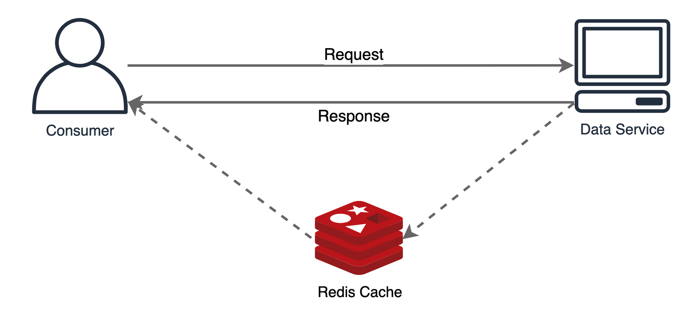
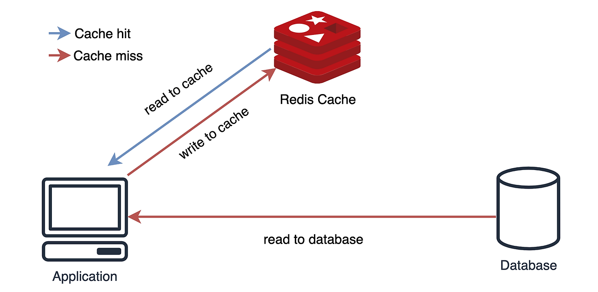
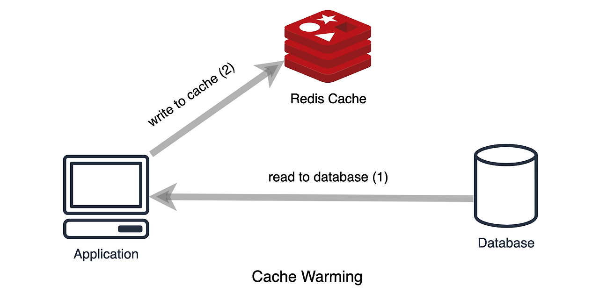
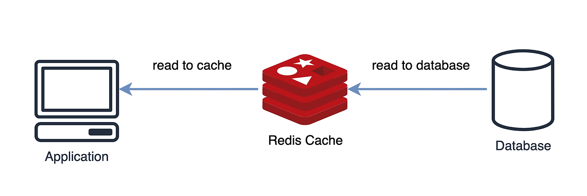
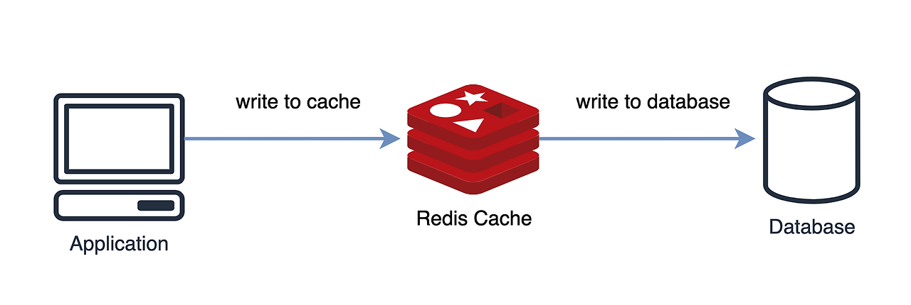
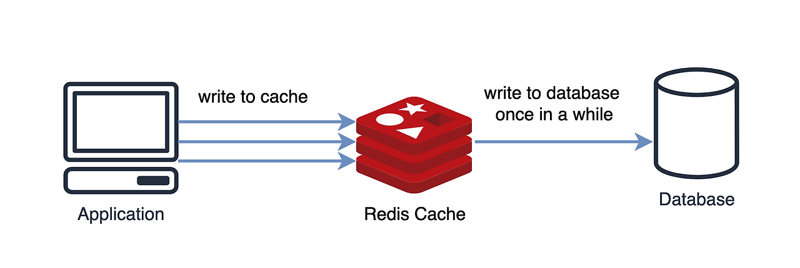
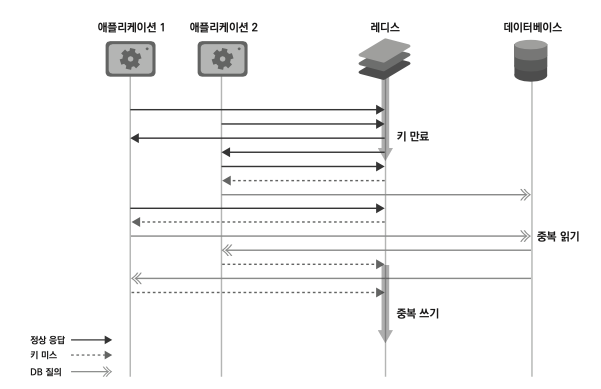

# Week 7 Step 13 보고서

---

## 1. 캐시
### 1.1 캐시란?

캐시란 데이터의 원본보다 더 빠르고 효율적으로 액세스할 수 있는 임시 데이터 저장소를 의미한다.

사용자가 동일한 정보를 반복적으로 액세스할 때 원본이 아니라 캐시에서 데이터를 가지고 옴으로써 리소스를 줄일 수 있다.

### 1.2 캐시를 사용하면 좋은 상황
애플리케이션이 다음 조건을 만족시킨다면 캐시를 도입했을 때 성능을 효과적으로 개선할 수 있다.
- 원본 데이터 저장소에서 원하는 데이터를 찾기 위해 검색하는 시간이 오래 걸리거나, 매번 계산을 통해 데이터를 가져와야 한다.
- 캐시에서 데이터를 가져오는 것이 원본 데이터 저장소 데이터를 요청하는 것보다 빨라야 한다.
- 캐시에서 저장된 데이터는 잘 변하지 않는 데이터다.
- 캐시에 저장된 데이터는 자주 검색되는 데이터다.

원본 데이터 저장소 데이터를 가지고 오는 시간을 단축시키기 때문에 애플리케이션의 응답 속도를 줄일 수 있다.
또한 원본 데이터 저장소에서 데이터를 읽는 커넥션을 줄일 수 있다. 캐시를 적절하게 배치함으로써 애플리케이션의 확장 또한 가능하다.

만약에 원본 데이터 저장소에서 데이터를 가져올 때 CPU와 메모리 등의 리소스를 많이 사용했다면 캐시를 사용함으로 애플리케이션 자체의 리소스를 줄일 수 있다. 같은 값을 도출하기 위해 계속 같은 계산을 할 필요가 없으므로 리소스를 최적화시킬 수 있게 된다.

### 1.3 캐시로서의 레디스
레디스는 단순하게 키-값 형태로 저장하므로 데이터를 저장하고 반환하는 것이 굉장히 간단하며, 자체적으로 다양한 자료 구조를 제공하기 때문에 자료 구조를 변환하는 과정 없이 레디스에 바로 저장할 수 있다.

또한 레디스는 모든 데이터를 메모리에 저장하는 인메모리 데이터 저장소이기 때문에 데이터를 검색하고 반환하는 것이 상당히 빠르다. 관계형 데이터베이스에서는 테이블의 특정 데이터를 찾으려면 우선 디스크에 접근해 데이터를 검색해와야 한다. 하지만 레디스에서는 모든 데이터가 메모리 위에 존재하기 때문에 데이터에 접근하는 시간이 굉장히 빠르다.

---

## 2. 캐싱 전략
캐시를 어떻게 배치할 것인지에 따라 서비스의 상능에 큰 영향을 끼칠 수 있다.
캐싱 전략은 캐싱되는 데이터의 유형과 데이터에 대한 액세스 패턴에 따라 다르기 때문에 서비스에 맞는 적절한 캐싱 전략을 선택하는 것이 중요하다.

### 2.1 look aside



애플리케이션이 찾고자 하는 데이터가 먼저 캐시에 있는지를 확인한 다음, 캐시에 데이터가 있으면 캐시에서 데이터를 읽어온다. (캐시 히트)

레디스에 찾고자 하는 데이터가 없을 때에는 캐시 미스가 발생하며, 데이터가 없다는 응답을 받은 애플리케이션은 직접 데이터베이스에 접근해 찾고자 하는 데이터를 가져온다. 그 뒤 애플리케이션은 데이터를 캐시에 저장한다.

찾고자 하는 데이터가 레디스에 없을 때에만 레디스에 데이터가 저장되기 때문에 lazy loading이라고도 부른다. 

레디스에 문제가 생겨 접근을 할 수 없는 상황이 발생하여도 바로 서비스 장애로 이어지지 않고 데이터베이스에서 데이터를 가지고 올 수 있다.

하지만 레디스가 다운되거나 데이터베이스에만 새로운 데이터가 있다면 캐시 미스로 인해서 많은 프로세스가 데이터베이스에 접근하기 때문에 데이터베이스에 많은 부하가 생길 수 있다.
이런 경우를 대비하여 데이터베이스에서 캐시로 데이터를 미리 밀어넣어주는 작업을 하기도 한다.(캐시 워밍)



### 2.2 read through

캐시에서만 데이터를 읽어오는 전략이다.
캐시 미스가 발생한다면 캐시는 데이터베이스에서 데이터를 검색하고 캐시에 자체 업데이트를 한 뒤 애플리케이션에 데이터를 반환한다.

애플리케이션이 캐시를 직접 관리할 필요 없이 캐시 계층에서 자동으로 데이터 로딩을 담당한다.
첫번째 요청만 데이터베이스를 조회하고 이후 요청은 캐시에서 빠르게 응답이 가능하므로 데이터 조회 성능이 향상된다.

### 2.3 write through

데이터베이스에 업데이트할 때마다 매번 캐시에도 데이터를 함께 업데이트해주는 방식이다.

캐시는 항상 최신 데이터를 가지고 있을 수 있다는 장점이 있지만, 데이터는 매번 2개의 저장소에 저장되어야 하기 때문에 데이터를 쓸 때마다 시간이 많이 소요될 수 있다는 단점이 있다.

다시 사용되지 않을 데이터일 수도 있는데, 무조건 캐시에도 저장되기 때문에 일종의 리소스 낭비가 발생할 수 있으므로 데이터를 저장할 때 만료 시간을 사용하는 것을 권장되는 방식이다.

### 2.4 write behind(write back)

먼저 캐시에 데이터를 저장했다가 특정 시점마다 데이터베이스에 저장하는 방식이다.
쓰기가 빈번하게 발생하는 서비스에 적합하다.

먼저 데이터를 빠르게 접근할 수 있는 캐시에 업데이트한 뒤, 이후에는 건수나 특정 시간 간격 등에 따라 비동기적으로 데이터베이스에 업데이트하는 것이다.

---

## 3. 캐시 스탬피드
레디스를 캐시로 활용할 때 모든 키에 대해 만료 시간을 설정하는 것을 권장되지만 대규모 트래픽 환경에서 만료 시간을 어떻게 설정하느냐에 따라 캐시 스탬피드가 발생할 수 있다.

### 3.1 캐시 스탬피드란?


애플리케이션 1과 2가 look aside 방식으로 레디스를 사용하고 있다.
look aside 방식에서 애플리케이션은 레디스에 먼저 데이터가 있는지 질의한 후 데이터가 없을 때 데이터베이스에서 데이터를 읽어오는 과정을 반복한다.

이때 레디스에서 특정 키가 만료되는 시점에서 만약 여러 개의 애플리케이션에서 바라보던 키가 레디스에서 만료돼 삭제된다면 이 서버들은 한꺼번에 데이터베이스에 가서 데이터를 읽어오는 과정을 거친다. (중복 읽기 duplicate read)

일반적으로 정렬이나 카운팅처럼 데이터베이스에서 쿼리하는 데 오랜 시간이 걸리는 작업을 미리 계산해서 캐시에 저장해두기 때문에, 캐시에 데이터가 없는 경우 이 데이터를 다시 데이터베이스에 접근해서 계산하는 작업이 필요하다.
레디스에 데이터가 없다는 것을 인지한 여러 애플리케이션에서 동시에 데이터베이스에 접근해 무거운 쿼리를 실행하는 중복 읽기 작업은 데이터베이스에 부하를 줄 수 있으며, 이는 곧 서비스 이슈로도 이어질 수 있다.

이후 각 애플리케이션에서는 읽어온 데이터를 레디스에 쓰게 되는데, 이 또한 여러 번 반복되기 때문에 (중복 쓰기 duplicate write)가 발생한다.

이런 중복 읽기 중복 쓰기 현상이 캐시 스탬피드 현상이다.

한번 캐시 스탬피드 현상이 발생하면 결과적으로 더 많은 데이터가 이 현상의 영향을 받게 돼, 곧 더 큰 문제로 이어질 수 있다. (계단식 실패 cascading failure)

### 3.2 캐시 스탬피드를 줄이는 방법
- 적절한 만료 시간 설정
  - 만료 시간을 너무 짧지 않게 설정한다.
  - 여러 애플리케이션에서 한꺼번에 접근해야 하는 데이터이며, 반복적으로 사용돼야 하는 데이터라면 저장 시점부터 만료 시간을 충분히 길게 설정해주는 것이 좋다.
- 선 계산
  - 캐시 스탬피드가 문제되는 이유는 데이터가 만료되는 시점에 여러 애플리케이션에서 동시다발적으로 이를 인지하고 , 이후 작업을 동시에 진행하기 때문이다.
  - 만약에 키가 실제로 만료되기 전에 이 값을 미리 갱신해준다면 여러 애플리케이션에서 한꺼번에 데이터베이스에 접근해 데이터를 읽어오는 과정을 줄여 불필요한 프로세스를 줄일 수 있다.
- PER 알고리즘
  - Probabilistic Early Recomputation 알고리즘
  - 이 알고리즘을 이용하면 캐시 값이 만료되기 전에 언제 데이터베이스에 접근해서 값을 읽어오면 되는지 최적으로 계산할 수 있다.
```
    currentTime - ( timeToCompute * beta * log(rand()) ) > expiry
```
> - currentTime: 현재 남은 만료 시간 
> - timeToCompute: 캐시된 값을 다시 계산하는 데 걸리는 시간 
> - beta: 기본적으로 1. 0보다 큰 값으로 설정 가능 
> - rand(): 0과 1 사이의 랜덤 값을 반환하는 함수
> - expiry: 키를 재설정할 때 새로 넣어줄 만료 시간

---

## 4. 프로젝트 개선 로직
### 4.1 목적
데이터베이스에 과부하를 주는 조회 및 업데이트 연산을 Redis를 활용하여 최적화하고,
트래픽이 증가하는 상황에서도 안정적으로 서비스가 운영될 수 있도록 성능 개선을 수행한다.

### 4.2 상위 상품 조회
#### 4.2.1 문제점
- 집계 연산이 반복적으로 수행되어 조회가 될 때마다 부하가 증가한다.
- 동일한 데이터를 다수의 반복적으로 수행된다.

#### 4.2.2 개선 방안
- Read-Through 전략을 사용하여 매일 정해진 시각에 자동으로 원본 데이터를 조회하도록 한다.
- Sorted Sets 자료구조로 판매량을 점수로 하여 판매량 순위를 정렬한다.

### 4.3 선착순 쿠폰 발급
#### 4.3.1 문제점
- 다수의 사용자가 동시에 요청하면 DB 락(Contention) 문제가 발생한다.
- 트랜잭션 충돌로 인해 발급 속도가 느려지거나 성능 저하될 수 있다.

#### 4.3.2 개선 방안
- Sorted Set(ZSET) 활용하여 대기열을 구현한다.
- Write-Behind 전략을 사용하여 쿠폰 발급 확정 시에 데이터베이스에 데이터를 저장한다.


### 4.4 기대효과
- DB 부하 감소 → 고성능 캐시 활용으로 불필요한 쿼리 실행 감소
- 고성능 실시간 처리 → Redis 활용으로 응답 속도 개선
- 트래픽 급증 대비 → 캐시 TTL 및 비동기 처리로 안정적 운영 가능
